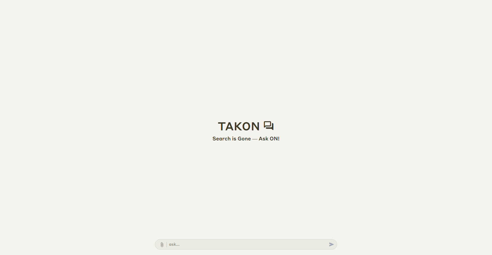
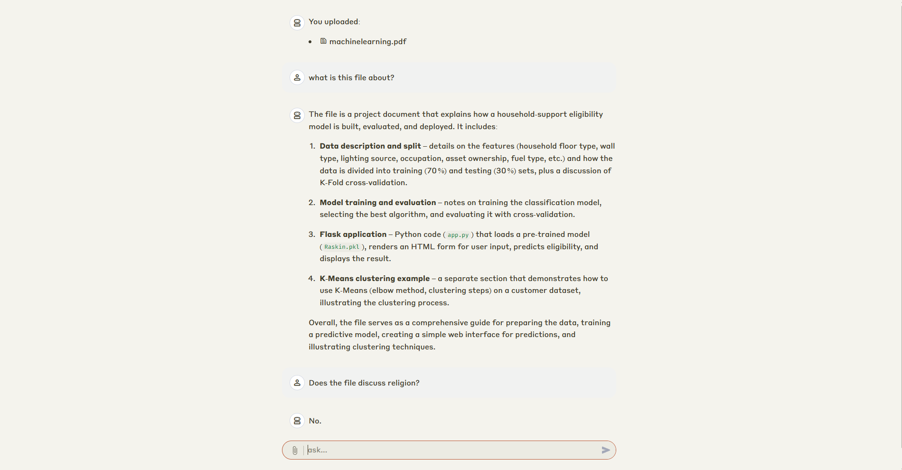

# TAKON 🧠

TAKON adalah aplikasi tanya jawab berbasis RAG (Retrieval-Augmented Generation) yang memungkinkan kamu bertanya langsung kepada dokumen milikmu sendiri menggunakan model GPT-OSS-20B. Aplikasi ini dibangun dengan antarmuka berbasis Streamlit agar mudah digunakan langsung di browser, lengkap dengan dukungan unggah file.

## 🔍 Fitur

- Upload dokumen sekali, lalu ajukan pertanyaan langsung
- Proses pencarian kontekstual dengan RAG
- Jawaban dihasilkan oleh model GPT-OSS-20B
- Antarmuka web sederhana dengan Streamlit

## 🧠 Teknologi yang Digunakan

- RAG (Retrieval-Augmented Generation)
- [GPT-OSS-20B](https://openai.com/id-ID/index/introducing-gpt-oss/)
- [LlamaIndex](https://docs.llamaindex.ai/en/stable/)

## 🚀 Coba Aplikasi

> **Note:** Karena aplikasi dihosting menggunakan Streamlit Community Cloud (free tier), aplikasi bisa dalam kondisi sleep. Jika muncul tombol “Yes, get this app back up!”, klik tombol tersebut untuk membangunkan aplikasi.

🌐 [Link Demo Aplikasi](https://takono.streamlit.app/)
